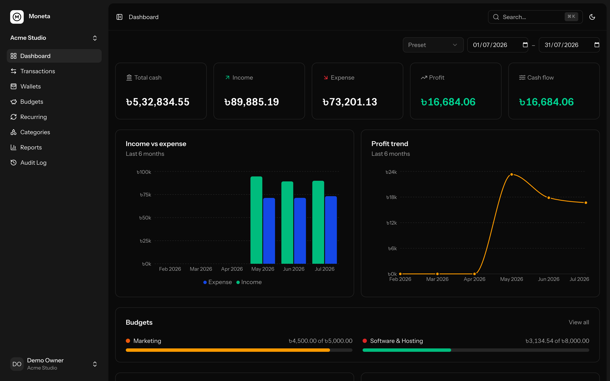

[](https://github.com/revoltify/moneta/actions)

---

## About Moneta

Moneta is a self-hosted money management app for small businesses and freelancers. Track income and expenses across wallets, watch budgets, and read clean financial reports — without accounting overhead. Single-user by design: your books, your server.

It ships with a built-in [MCP](https://modelcontextprotocol.io) server, so AI agents like Claude can record transactions and pull reports for you.

## Quick Start

```bash
docker run -d --name moneta \
  -p 8080:8080 \
  -v moneta-storage:/app/storage \
  ghcr.io/revoltify/moneta:latest
```

Open http://localhost:8080 and log in with `admin@admin.com` / `12345678` (change it in *Settings → Security*).

Prefer Compose? Grab [`compose.yaml`](compose.yaml) and run `docker compose up -d`. No Docker? See [manual installation](#manual-installation).

## Features

- Dashboard with cash, income, expense, profit and cash-flow at a glance
- Income / expense / transfer / capital entry flows with edit and void
- Wallets with running-balance ledgers and one-click reconcile
- Budgets with alert thresholds
- Recurring transactions with catch-up
- Reports: Income Statement, Balance Sheet, Cash Flow, Category Breakdown, Monthly Summary
- Multiple companies side by side, each with its own currency and timezone
- AI agent access via MCP (26 tools) — OAuth or API tokens
- Audit log, ⌘K global search, dark mode, 2FA and passkeys
- Integer money storage (no float drift) + `finance:verify-balances` integrity check

## Configuration

### Environment variables

Everything is optional — the Docker container works with zero configuration.

| Variable | Default | Purpose |
|---|---|---|
| `APP_URL` | `http://localhost:8080` | Public URL of your instance |
| `APP_KEY` | auto-generated, persisted in volume | Encryption key |
| `MONETA_ADMIN_NAME` | `Admin` | Admin name (first boot only) |
| `MONETA_ADMIN_EMAIL` | `admin@admin.com` | Admin email (first boot only) |
| `MONETA_ADMIN_PASSWORD` | `12345678` | Admin password (first boot only) |
| `MONETA_COMPANY` | `Demo Company` | First company name (first boot only) |
| `DB_CONNECTION` | `sqlite` | Set `mysql` / `pgsql` + the usual `DB_*` vars for an external database |

### Good to know

- **One volume is your entire state**: `/app/storage` holds the SQLite database, app key and OAuth keys. Back it up; never delete it.
- First boot initializes everything (keys, database, admin account). Restarts are idempotent.
- The scheduler (recurring transactions) runs inside the container via cron — nothing extra to set up.
- For HTTPS, put the container behind your reverse proxy (Caddy, Traefik, nginx). Forwarded headers are trusted.

## Manual Installation

Requires PHP 8.3+, Composer, Node 20+.

```bash
git clone https://github.com/revoltify/moneta.git && cd moneta

composer run setup           # deps, .env, keys, database, migrations, frontend build
php artisan moneta:install   # admin account + first company
```

Serve `public/` with your web server of choice ([Laravel Herd](https://herd.laravel.com), Valet, nginx + FPM, or `php artisan serve`), and add the scheduler to cron:

```
* * * * * php /path/to/moneta/artisan schedule:run >> /dev/null 2>&1
```

Same default login as Docker: `admin@admin.com` / `12345678`, or pass your own:

```bash
php artisan moneta:install --name="Jane" --email="jane@example.com" --password="strong-password" --company="Acme"
```

---

## Connect an AI agent (MCP)

Moneta exposes everything at `POST /mcp` — reports, transactions, wallets, budgets, recurring. Two ways in:

**OAuth (claude.ai / Claude Desktop connectors):** add your instance URL + `/mcp` as a connector and approve access in the browser. Discovery and client registration are automatic.

**Bearer token (Claude Code, scripts):** create a token under *Settings → API tokens*, then:

```bash
claude mcp add --transport http moneta https://your-instance.com/mcp \
  --header "Authorization: Bearer <token>"
```

Then just ask: *"record a 2,500 office rent expense from the Bank wallet"* or *"show me this month's income statement"*.

---

## FAQ

**I forgot my password.** There's no email-based reset (no mailer needed). From the server:

```bash
php artisan tinker --execute 'App\Models\User::first()->update(["password" => "new-password"]);'
```

**Can I try it with demo data?** `php artisan migrate:fresh --seed` creates a populated workspace — log in as `demo@example.com` / `password`.

**Can multiple people use it?** No — Moneta is intentionally single-user. One admin, multiple companies.

**Which databases are supported?** SQLite (default, zero-config), MySQL and PostgreSQL.

---

## Development

```bash
composer run dev       # app + hot-reloading frontend
composer test          # full gate: pint, phpstan, eslint, tsc, pest
php artisan test --compact --filter=Name   # single test
```

Issues and pull requests welcome — `composer test` must pass.

## License

[AGPL-3.0](LICENSE.md)
